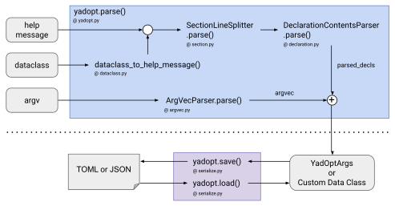

<div align="center">
  
</div>

<div align="center">
  
  &nbsp;
  
  &nbsp;
  
  &nbsp;
  
</div>

YadOpt - Yet another docopt
========================================================================================================================

YadOpt is a modernized [docopt](https://github.com/docopt) for Python with static typing, serialization,
and reproducibility support. Define your CLI once as a human-readable text. YadOpt does the rest.


Quick example
------------------------------------------------------------------------------------------------------------------------

### 1. Help-message-driven command-line argument parsing

```python
"""
Train a convolutional neural network model on an image classification dataset.

Mandatory arguments:
    output_dir_path    Path to output directory.

Training options:
    --optimizer STR    Optimizer name.                 [default: sgdm]
    --lr FLOAT         Learning rate.                  [default: 1.0E-3]
    --epochs INT       The number of training epochs.  [default: 100]
"""

import yadopt

# Parse into an instance of yadopt.YadOptArgs.
args = yadopt.parse(__doc__)
print(args)

# You can save the parsed arguments to a file and restore them later.
yadopt.save("args.toml", args)
```

Save this code as `sample1.py` and run it as follows:

```console
$ python3 sample1.py mlruns --optimizer adam --lr 1.0E-3 --epochs 10
YadOptArgs(output_dir_path=PosixPath('mlruns'), optimizer='adam', lr=0.001, epochs=10)
```

Unlike libraries such as [Click](https://github.com/pallets/click) and [Typer](https://github.com/fastapi/typer),
where the CLI is defined in Python code, YadOpt treats the human-readable specification itself as the single source
of truth. You usually do not need to memorize the rules &mdash; just write a normal help message, and YadOpt will
point out the few places where you need to be explicit, like the following:

```
<Error summary>
    File "run_tests.py", L. 111, in main
    Invalid comma usage is found in optional argument declaration.

<Details>
    L.2:     --opt, VALUE   This is a description.
                  ^

<Solution>
    Please check the comma usage in the optional argument declaration.
```

You can view the help message and exit the script using the `--help` option. The `--help` is not defined in the help
message above, but YadOpt always treats it as a special option to display the help message and exit. If you need
a short alias for `--help`, such as `-h`, you can define it in the help message as below:

```
Other options:
    -h, --help      Show this help message and exit.
```

YadOpt does not require a usage section, in contrast to [docopt](https://github.com/docopt). In many cases, the CLI
structure is already clear from the declarations of positional and optional arguments, so requiring a separate usage
section could be a burden on the user. This design is intentional &mdash; especially for short-lived scripts such as
machine learning experiments, where minimizing boilerplate matters. The help message generated by `--help` contains
an auto-generated usage section, like the following:

```console
$ python3 sample1.py --help
Usage:
    sample1.py [--optimizer STR] [--lr FLOAT] [--epochs INT] <output_dir_path>

Train a convolutional neural network model on an image classification dataset.

Mandatory arguments:
    output_dir_path           Path to output directory.

Training options:
    --optimizer STR           Optimizer name.                     [default: sgdm]
    --lr FLOAT                Learning rate.                      [default: 1.0E-3]
    --epochs INT              The number of training epochs.      [default: 100]
```


### 2. Dataclass-driven command-line argument parsing

YadOpt now supports dataclasses for command-line argument parsing. Unlike Typer, the comments after the definition
of the fields in the dataclass are used as the description of the help message. Internally, YadOpt generates
a help message from the dataclass type and parses the command-line arguments into an instance of the dataclass.

```python
import dataclasses
import yadopt

@dataclasses.dataclass
class Config:
    """
    Configuration for the script.
    """
    output_dir: yadopt.Path    # Path to output directory.
    optimizer : str  = "sgdm"  # Optimizer name.
    num_epochs: int  = 100     # The number of training epochs.
    cpu_only  : bool = False   # Whether to use CPU only.

# Parse into an instance of the "Config" dataclass.
config: Config = yadopt.parse(Config)
print(config)
```

Save this code as `sample2.py` and run it as follows:

```console
$ python3 sample2.py mlruns --optimizer adam --num_epochs 10
Config(output_dir=PosixPath('mlruns'), optimizer='adam', num_epochs=10, cpu_only=False)
```

```
$ python3 sample2.py --help
Usage:
    sample2.py [--optimizer VALUE] [--num_epochs VALUE] [--cpu_only] <output_dir>

Arguments:
    output_dir   (Path) Path to output directory.

Options:
    --optimizer VALUE    (str)  Optimizer name.                [default: 'sgdm']
    --num_epochs VALUE   (int)  The number of training epochs. [default: 100]
    --cpu_only           (bool) Whether to use CPU only.       [default: False]
```


Installation
------------------------------------------------------------------------------------------------------------------------

You can install YadOpt via [pip](https://pip.pypa.io/en/stable/):

```console
$ pip install yadopt
```


Usage
------------------------------------------------------------------------------------------------------------------------

### Use `parse` function

The `yadopt.parse` function allows you to parse command-line arguments based on your docstring. By default, the function
parses `sys.argv[1:]`, but you can explicitly specify the argument vector by using the second argument of the function,
as shown below.

```python
# Parse "sys.argv[1:]" (default behavior).
args = yadopt.parse(__doc__)

# Parse the given argument vector "argv".
args = yadopt.parse(__doc__, argv)
```

### Use `wrap` function

YadOpt also supports decorator-style command-line parsing through the `@yadopt.wrap` decorator.
The decorator takes the same arguments as the function `yadopt.parse`.

```python
@yadopt.wrap(__doc__)
def main(args: yadopt.YadOptArgs, arg1: int, arg2: str):
    ...

if __name__ == "__main__":
    main(arg1=1, arg2="2")
```

### How to specify argument and option types

YadOpt provides two ways to specify argument and option types:
(1) type declaration in the description head, and (2) type suffix.

**(1) Type declaration in the description head**: An alternative way to specify argument and option types
is to precede the description with the type name in parentheses.

```
Options:
    --opt1 VAL1    (float) Option with floating-point type.
    --opt2 VAL2    (str)   Option with string type.
```

**(2) Type suffix**: Users can specify argument and option types by appending a type name to
the argument or option value name, as in the following examples:

```
Options:
    --opt1 VALUE_INT   Option with integer type.
    --opt2 STR         Option with string type.
```

YadOpt currently supports the following types. Type names are case-insensitive,
and types not listed below (e.g., lists or enums) are not supported.
Note that the `auto_type` is a special type that automatically infers the type from the value.

| Data type in Python | Type name in help message (case insensitive) |
|---------------------|----------------------------------------------|
| `bool`              | bool, boolean                                |
| `int`               | int, integer                                 |
| `float`             | flt, float                                   |
| `pathlib.Path`      | path                                         |
| `str`               | str, string                                  |
| `auto_type`         | auto                                         |

However, any value that exactly matches `None` (case-sensitive) is always treated as `NoneType`,
regardless of the type specification above.

### Dictionary and named tuple support

The return value of `yadopt.parse` is an instance of `YadOptArgs`, which is implemented as a frozen dataclass.
However, sometimes a dictionary with the `get` accessor, or an immutable named tuple, may be preferable.
In such cases, you can use `yadopt.to_dict` or `yadopt.to_namedtuple` function.

```python
# Convert the return value to dictionary.
args = yadopt.to_dict(yadopt.parse(__doc__))

# Convert the return value to namedtuple.
args = yadopt.to_namedtuple(yadopt.parse(__doc__))
```

### Restore arguments from a file

YadOpt has the ability to save parsed argument instances to a file and load them back later. These features are
useful, for example, in machine learning code, when you want to reuse exactly the same arguments after a previous
execution. Supported file formats include TOML, JSON, and their compressed versions (`.toml.gz` and `.json.gz`).

```python
# First, parse the command line arguments and create an instance of YadOptArgs.
args = yadopt.parse(__doc__)

# Save the parsed arguments as a TOML file.
yadopt.save("args.toml", args)

# Restore parsed YadOptArgs instance from the TOML file.
args_restored = yadopt.load("args.toml")
```

The structure of the TOML and JSON files is simple &mdash; the parsed arguments, along with their type information,
are stored in a TOML/JSON file, organized into sections by group. It is not recommended to create a TOML/JSON file
manually from scratch, but it should be easy to make manual modifications to a generated file.

The generated TOML/JSON file includes metadata about the execution environment, such as the hostname, username,
platform, Python version, Git commit hash of the repository, and a timestamp. If you prefer not to store this
information, you can set `metadata=False` when calling `yadopt.save`. In that case, only the timestamp will be
included as metadata.

### Extract one section

The function `yadopt.get_group` allows you to extract a specific section from the help message.
The following example demonstrates how to extract the "Options" section from the help message.

```
"""
Arguments:
    arg       This is a positional argument.

Options:
    --opt1    This is a flag option.
"""

import yadopt

# Parse the help message first.
args = yadopt.parse(__doc__)

# Then, extract the "Options" section.
args_options = yadopt.get_group(args, "Options")
print(args_options)
```


Motivation
------------------------------------------------------------------------------------------------------------------------

Why is command-line argument parsing for CLI programs still so unnecessarily cumbersome? In machine learning workflows,
engineers frequently write short-lived scripts with many command-line parameters:

```sh
python3 train.py --model resnet50 --optimizer adam --lr 1.0E-4 --epochs 300 ...
```

Despite their simplicity, many command-line parsers, including third-party solutions such as
[Click](https://github.com/pallets/click) and [Typer](https://github.com/fastapi/typer),
still require developers to describe the same information repeatedly across parser definitions, help messages,
configuration files, and type declarations. While [docopt](https://github.com/docopt) addressed part of this problem
by treating the help message as the CLI definition. However, it does not provide native support for modern Python
features such as type hints, configuration management, and reproducibility. YadOpt extends this idea: define your CLI
once as a human-readable specification, and it becomes a parser, a typed interface, and a reproducible configuration
source all in one place.

Ultimately, YadOpt aims to make command-line argument parsing simple enough that, if someone sitting next to you
is struggling with it, you can simply say:

<p align="center"><i>
    Try writing something that looks like a normal help message and pass it to YadOpt
    &mdash; it just works!
</i></p>

### Comparison with other similar libraries

| Feature / Aspect          | argparse              | click                    | typer                    | docopt                     | YadOpt                    |
|---------------------------|-----------------------|--------------------------|--------------------------|----------------------------|---------------------------|
| Definition style          | API (object-oriented) | Decorators               | Type hints + decorators  | Docstring                  | Docstring / Dataclass     |
| Verbosity per option      | Multiple statements   | One decorator per option | Function signature       | Single-line declaration    | Single-line declaration   |
| Type handling             | Explicit              | Explicit                 | Python type hints        | Manual conversion required | Optional type hints       |
| Help message source       | Generated from code   | Generated from code      | Generated from code      | Source of truth            | Source of truth           |
| Scaling with many options | Code grows linearly   | Decorators grow linearly | Annotations may increase | Remains concise            | Remains concise           |
| Configuration reuse       | Manual                | Manual                   | Manual                   | Manual                     | Built-in (save/load)      |
| Typical use case          | General CLI           | Complex CLI apps         | Modern typed CLI         | Documentation-driven CLI   | Short-lived scripts / ML  |

Note: The comparison above focuses on structural differences rather than subjective preferences. In the author's view,
Typer provides an elegant approach to CLI definition using standard Python type hints without requiring a new
domain-specific syntax. Its usability is particularly high when argument descriptions are omitted.
However, when detailed argument descriptions are required, additional annotations using `typer.Argument` become
necessary, and the definition can become more verbose. Some libraries attempt to address this by providing more
concise ways to express these descriptions. This is a promising direction, but in practice, this often requires adopting
some form of custom syntax, similar to docopt. From this perspective, YadOpt intentionally embraces a docopt-style
approach and aims to eliminate redundancy, particularly in machine learning use cases.


Developer's note
------------------------------------------------------------------------------------------------------------------------

### Preparation

Additional commands and Python packages are required for developers to measure the number of lines in the code,
code quality, etc. Please run the following command (the author recommends using
[venv](https://docs.python.org/3/library/venv.html) to avoid polluting your development environment).

```console
$ apt install cloc docker.io
$ pip install -r requirements-dev.txt
```

### Utility commands for developers

The Makefile provides several utility commands. Please run `make` at the root directory of this repository to see
the details of the subcommands in the Makefile.

```console
$ make
Usage:
    make <command>

Build commands:
    build         Build package
    testpypi      Upload package to TestPyPi
    pypi          Upload package to PyPi
    install-test  Install from TestPyPi

Test and code check commands:
    check         Check the code quality
    count         Count the lines of code
    coverage      Measure code coverage
	test          Run test on this device
	testall       Run test on Docker

Other commands:
    clean         Cleanup cache files
    help          Show this message
```

### Architecture diagram



